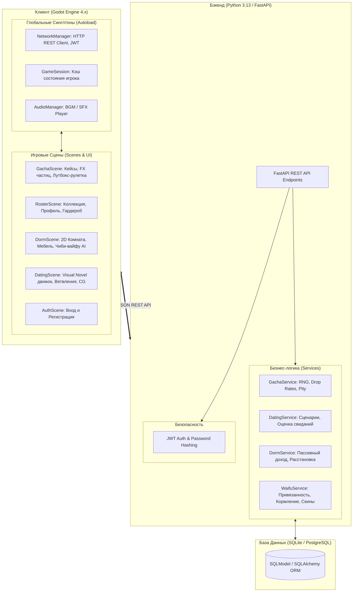
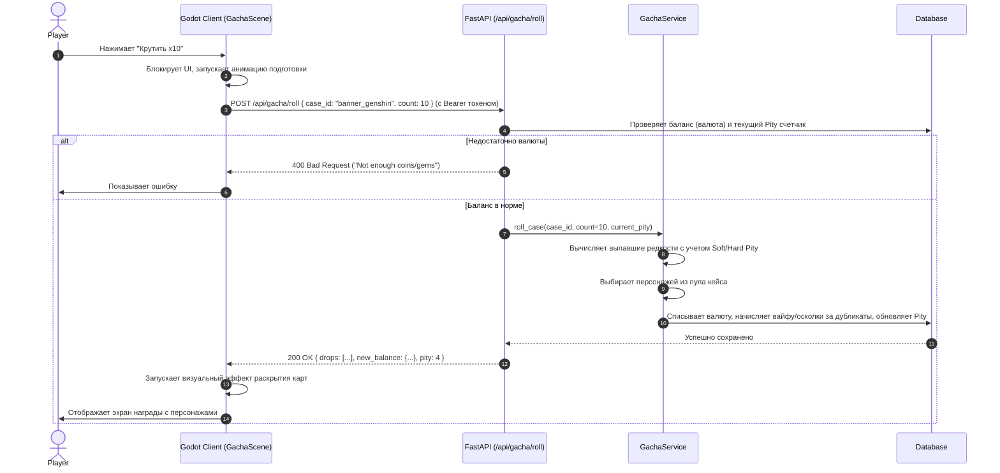
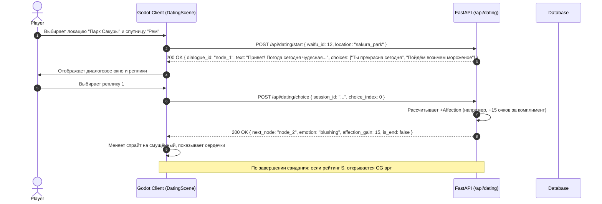

# Архитектура Проекта (ARCHITECTURE.md)
## Проект: Anime Paradise — Waifu Gacha & Dating Sim

---

## 1. Обзор Системной Архитектуры

Архитектура системы строится по клиент-серверной модели с жестким разграничением ответственности:
- **Сервер (FastAPI / Python):** единый источник истины (Single Source of Truth), отвечает за аутентификацию, безопасность, генерацию случайных чисел (RNG), проверку транзакций, расчет пассивного дохода и прогресс свиданий.
- **Клиент (Godot Engine 4 / GDScript):** отвечает за презентационный слой: рендеринг 2D-сцен, воспроизведение анимаций и спецэффектов (VFX), обработку пользовательского ввода, звук (SFX/BGM) и кэширование статических данных.



---

## 2. Технологический Стек

| Компонент | Технология | Роль и обоснование |
|---|---|---|
| **Игровой Клиент** | Godot Engine 4 (GDScript) | Высокая производительность 2D-графики, гибкая система нод UI (Control), встроенная система частиц (GPUParticles2D), плавная анимация через Tween, экспорт в Windows / Linux / HTML5. |
| **Сетевой протокол** | HTTP/REST (JSON) | Простота отладки, высокая скорость, stateless-авторизация по токенам Bearer JWT. |
| **Бэкенд-фреймворк** | Python 3.13 + FastAPI + Uvicorn | Асинхронный высокопроизводительный веб-сервер, автоматическая валидация через Pydantic, скорость ответа API < 20мс. |
| **База Данных & ORM** | SQLite / PostgreSQL + SQLModel | Простота развертывания локально (SQLite файл) и легкий переход на PostgreSQL при росте базы игроков. |
| **Управление пакетами** | `uv` (Astral uv) | Мгновенная установка виртуального окружения и зависимостей в Python. |

---

## 3. Архитектура Клиента Godot 4

#### 3.1. Структура проекта Godot
```
client/
├── project.godot                  # Главный файл конфигурации Godot 4 (1920x1080 canvas_items)
├── assets/
│   ├── characters/                # Арты вайфу (высокое разрешение 16:9 / 3:4)
│   ├── backgrounds/               # Фоны баннеров и свиданий (bg_banner, bg_sakura_park, bg_cozy_cafe)
│   ├── cases/                     # Иконки и графика кейсов
│   └── ui/                        # Элементы интерфейса
├── shaders/                       # Шейдеры визуальных эффектов
│   ├── holographic_card.gdshader  # Голографический радужный перелив для SSR/UR карт
│   └── summoning_portal.gdshader  # Вихрь призывного портала с динамическим цветом редкости
├── scenes/
│   ├── main/                      # Главный каркас HUD (TopBar, ContentArea, BottomBar)
│   ├── auth/                      # Модальное окно входа / регистрации с затемнением
│   ├── gacha/                     # Экран баннеров, призывной оверлей, переворот карт, итоги
│   ├── roster/                    # Коллекция персонажей, детальный профиль, гардероб
│   ├── dorm/                      # Общежитие с пассивным доходом и чиби-вайфу
│   └── dating/                    # Визуальная новелла свиданий с эффектом печатной машинки
├── scripts/
│   ├── autoload/
│   │   ├── NetworkManager.gd      # HTTP REST клиент, хранение JWT, обработка ошибок
│   │   ├── GameSession.gd         # Реактивное хранилище баланса, вайфу, кэш текстур
│   │   └── AudioManager.gd        # 16-битный синтезатор звука и BGM эмбиент
│   └── utils/
│       └── StyleHelper.gd         # Централизованная дизайн-система, цвета, рамки и шейдеры
└── resources/                     # Темы UI и кастомные ресурсы
```

### 3.2. Архитектура ключевых сцен Godot

#### 1. `GachaScene` (Система призыва и кейсов)
- **Banner Selector & Pity Tracker:**
  - Интерактивные вкладки с неоновым выделением активного баннера.
  - Прогресс-бар гаранта (Pity Bar) с живым счетчиком оставшихся круток до SSR/UR.
  - Окно вероятностей (`RatesModal`) с цветовой разметкой BBCode по редкостям.
- **State Machine Призыва:**
  1. `IDLE`: Браузинг баннеров, выбор 1x / 10x призыва.
  2. `SUMMONING_PORTAL`: Полноэкранный космический оверлей. Шейдерный вихрь `summoning_portal.gdshader` вращается с нарастанием скорости и заряда. Цвет портала и взрыв частиц (`CPUParticles2D`) адаптируются под наивысшую редкость в пачке (UR: Радуга, SSR: Золото, SR: Аметист, R: Лазурь).
  3. `CARD_REVEAL`: Для одиночных круток — драматический горизонтальный 3D-Tween переворот карты с приветственной цитатой и фанфарами.
  4. `SUMMARY`: Итоговая сетка карт в рамках `StyleHelper.create_card_frame(rarity)`. Карты SSR и UR сияют динамическим шейдером `holographic_card.gdshader`. Кнопки «Еще 1x» и «Еще 10x» позволяют крутить кейсы без перезахода.
  - Кнопка «Пропустить ▶▶» доступна в любой момент для быстрого пропуска анимаций.

#### 2. `DormScene` (Общежитие)
- Сцена с верхним информационным баром (Уют, Накопленный доход) и кнопкой быстрого сбора монет.
- Чиби-вайфу с анимированным парением (idle bobbing tween), рамками с мягким свечением и интерактивными поглаживаниями с частицами сердечек и диалоговыми облачками (`SpeechBubble`).

#### 3. `DatingScene` (Визуальная новелла)
- `DialogueBox`: Стилизованная полупрозрачная панель с посимвольной печатью реплик (Typewriter Effect) и возможностью мгновенного раскрытия по клику.
- Динамическая подгрузка фонов локаций (`bg_sakura_park.jpg`, `bg_cozy_cafe.jpg`) и портретов спутниц.
- Интерактивные парящие варианты ответов в диалоге с начислением очков любви и финальным романтическим окном ранга S с памятной CG-иллюстрацией.

---

## 4. Архитектура Бэкенда (Python FastAPI)

### 4.1. Структура проекта сервера
```
server/
├── app/
│   ├── api/
│   │   ├── auth.py                # Регистрация, вход, обновление токена
│   │   ├── gacha.py               # Список кейсов, крутка 1x/10x, проверка гаранта
│   │   ├── waifus.py              # Список вайфу игрока, прокачка, кормление, скины
│   │   ├── dorm.py                # Состояние комнаты, мебель, сбор монет
│   │   └── dating.py              # Запуск свидания, выбор реплик, начисление CG
│   ├── core/
│   │   ├── config.py              # Настройки окружения (JWT_SECRET, DB_URL)
│   │   ├── database.py            # Инициализация Engine и Session SQLModel
│   │   └── security.py            # Bcrypt хеширование, кодирование JWT
│   ├── data/                      # Статические манифесты контента
│   │   ├── characters.json        # База характеристик, любимой еды и скинов
│   │   ├── cases.json             # База кейсов, вероятностей и пулов
│   │   ├── furniture.json         # Каталог мебели и параметров комфорта
│   │   └── dating_scripts.json    # Деревья диалогов свиданий и локаций
│   ├── models/
│   │   ├── user.py                # Модель игрока (логин, пароль, монеты, гемы, шарды)
│   │   ├── waifu.py               # Экземпляр вайфу (уровень, привязанность, скин)
│   │   ├── inventory.py           # Предметы, еда, мебель
│   │   └── gacha_pity.py          # Счетчики гаранта игрока по каждому кейсу
│   ├── services/
│   │   ├── gacha_service.py       # Логика дропа и гаранта
│   │   ├── dorm_service.py        # Расчет пассивного дохода по времени
│   │   └── dating_service.py      # Обработка прогрессии свиданий
│   └── main.py                    # Инициализация FastAPI приложения и CORS
├── requirements.txt
└── pyproject.toml
```

### 4.2. Спецификация Базы Данных (SQLModel Схемы)

```python
from sqlmodel import SQLModel, Field, Relationship
from typing import Optional, List
from datetime import datetime

class User(SQLModel, table=True):
    id: Optional[int] = Field(default=None, primary_key=True)
    username: str = Field(unique=True, index=True)
    hashed_password: str
    coins: int = Field(default=1000)
    love_gems: int = Field(default=50)
    soul_shards: int = Field(default=0)
    created_at: datetime = Field(default_factory=datetime.utcnow)
    last_online: datetime = Field(default_factory=datetime.utcnow)

    waifus: List["UserWaifu"] = Relationship(back_populates="owner")
    pities: List["UserPity"] = Relationship(back_populates="owner")

class UserWaifu(SQLModel, table=True):
    id: Optional[int] = Field(default=None, primary_key=True)
    user_id: int = Field(foreign_key="user.id")
    character_id: str = Field(index=True)  # например, 'raiden_genshin'
    stars: int = Field(default=1)          # Количество возвышений
    affection_points: int = Field(default=0)
    affection_level: int = Field(default=1)
    current_outfit_id: str = Field(default="default")
    unlocked_outfits: str = Field(default="default")  # JSON список id скинов
    last_fed: Optional[datetime] = None
    last_headpat: Optional[datetime] = None
    dates_completed: int = Field(default=0)

    owner: User = Relationship(back_populates="waifus")

class UserPity(SQLModel, table=True):
    id: Optional[int] = Field(default=None, primary_key=True)
    user_id: int = Field(foreign_key="user.id")
    case_id: str = Field(index=True)
    pull_count: int = Field(default=0)
    sr_pity_count: int = Field(default=0)

    owner: User = Relationship(back_populates="pities")
```

---

## 5. Протоколы Взаимодействия (API Sequence Flow)

### 5.1. Крутка Кейса (Gacha Roll)


### 5.2. Интерактивное Свидание (Dating Flow)


---

## 6. Расширяемость Контента (Data-Driven Design)

1. **Добавление нового персонажа:**
   Достаточно добавить JSON-блок в `server/app/data/characters.json` с указанием характеристик, любимых блюд, реплик и путей к артам, а также поместить графические файлы (`full.png`, `chibi.png`, `icon.png`) в папку ассетов Godot.
2. **Добавление нового сценария свидания:**
   Сценарии хранятся в древовидном формате в `dating_scripts.json`. Создание новых диалогов и сюжетных веток не требует изменения кода бэкенда или клиента.
3. **Безопасность:**
   Клиент никогда не хранит закрытые ключи и шансы дропа. Все решения по начислению наград и изменению баланса принимает сервер с использованием транзакций базы данных.
